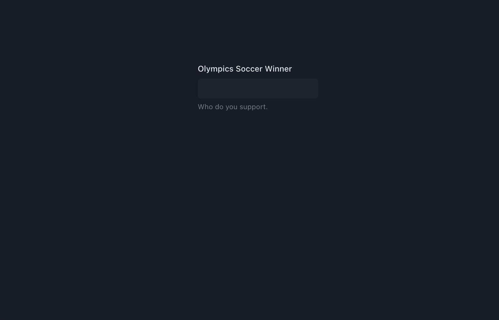

<div align="center">

  <h1>
    <br/>
    🏇
    <br />
    @choc-ui/chakra-autocomplete
    <br />
    <br />
  </h1>
  <sup>
    <br />
    <br />
    <a href="https://www.npmjs.com/package/@choc-ui/chakra-autocomplete?style=for-the-badge">
       
    </a>
    <a href="https://www.npmjs.com/package/@choc-ui/chakra-autocomplete?style=for-the-badge">
      
    </a>
<a>
    
</a>

<a>

<!-- ALL-CONTRIBUTORS-BADGE:START - Do not remove or modify this section -->

[](#contributors-)

<!-- ALL-CONTRIBUTORS-BADGE:END -->

</a>
    <br />
    AutoComplete Component for the <a href="https://chakra-ui.com">Chakra UI</a> Library.</em>
    
  </sup>
  <br />
  <br />
  <br />
  <br />
  <pre>npm i <a href="https://www.npmjs.com/package/@choc-ui/chakra-autocomplete">@choc-ui/chakra-autocomplete</a></pre>
  <br />
  <br />
  <br />
  <br />
  <br />
</div>

## Install

```bash
npm i --save @choc-ui/chakra-autocomplete
#or
yarn add @choc-ui/chakra-autocomplete
```

## Preview

### With Mouse



### With Keyboard


## Usage

### Basic Usage

```js
import { Flex, FormControl, FormHelperText, FormLabel } from "@chakra-ui/react";
import * as React from "react";
import {
  AutoComplete,
  AutoCompleteInput,
  AutoCompleteItem,
  AutoCompleteList,
} from "@choc-ui/chakra-autocomplete";

function App() {
  const countries = [
    "nigeria",
    "japan",
    "india",
    "united states",
    "south korea",
  ];

  return (
    <Flex pt="48" justify="center" align="center" w="full">
      <FormControl w="60">
        <FormLabel>Olympics Soccer Winner</FormLabel>
        <AutoComplete openOnFocus>
          <AutoCompleteInput variant="filled" />
          <AutoCompleteList>
            {countries.map((country, cid) => (
              <AutoCompleteItem
                key={`option-${cid}`}
                value={country}
                textTransform="capitalize"
              >
                {country}
              </AutoCompleteItem>
            ))}
          </AutoCompleteList>
        </AutoComplete>
        <FormHelperText>Who do you support.</FormHelperText>
      </FormControl>
    </Flex>
  );
}

export default App;

```


### Creating Groups

You can create groups with the `AutoCompleteGroup` Component, and add a title with the `AutoCompleteGroupTitle` component.

```js
import { Flex, FormControl, FormHelperText, FormLabel } from "@chakra-ui/react";
import * as React from "react";
import {
  AutoComplete,
  AutoCompleteGroup,
  AutoCompleteGroupTitle,
  AutoCompleteInput,
  AutoCompleteItem,
  AutoCompleteList,
} from "@choc-ui/chakra-autocomplete";

function App() {
  const continents = {
    africa: ["nigeria", "south africa"],
    asia: ["japan", "south korea"],
    europe: ["united kingdom", "russia"],
  };

  return (
    <Flex pt="48" justify="center" align="center" w="full">
      <FormControl w="60">
        <FormLabel>Olympics Soccer Winner</FormLabel>
        <AutoComplete openOnFocus>
          <AutoCompleteInput variant="filled" />
          <AutoCompleteList>
            {Object.entries(continents).map(([continent, countries], co_id) => (
              <AutoCompleteGroup key={co_id} showDivider>
                <AutoCompleteGroupTitle textTransform="capitalize">
                  {continent}
                </AutoCompleteGroupTitle>
                {countries.map((country, c_id) => (
                  <AutoCompleteItem
                    key={c_id}
                    value={country}
                    textTransform="capitalize"
                  >
                    {country}
                  </AutoCompleteItem>
                ))}
              </AutoCompleteGroup>
            ))}
          </AutoCompleteList>
        </AutoComplete>
        <FormHelperText>Who do you support.</FormHelperText>
      </FormControl>
    </Flex>
  );
}

export default App;

```


## Accessing the internal state

To access the internal state of the `AutoComplete`, use a function as children (commonly known as a render prop). You'll get access to the internal state `isOpen`, with the `onOpen` and `onClose` methods.

```js
import {
  Flex,
  FormControl,
  FormHelperText,
  FormLabel,
  Icon,
  InputGroup,
  InputRightElement,
} from "@chakra-ui/react";
import * as React from "react";
import {
  AutoComplete,
  AutoCompleteInput,
  AutoCompleteItem,
  AutoCompleteList,
} from "@choc-ui/chakra-autocomplete";
import { FiChevronRight, FiChevronDown } from "react-icons/fi";

function App() {
  const countries = [
    "nigeria",
    "japan",
    "india",
    "united states",
    "south korea",
  ];

  return (
    <Flex pt="48" justify="center" align="center" w="full">
      <FormControl w="60">
        <FormLabel>Olympics Soccer Winner</FormLabel>
        <AutoComplete openOnFocus>
          {({ isOpen }) => (
            <>
              <InputGroup>
                <AutoCompleteInput variant="filled" placeholder="Search..." />
                <InputRightElement
                  children={
                    <Icon as={isOpen ? FiChevronRight : FiChevronDown} />
                  }
                />
              </InputGroup>
              <AutoCompleteList>
                {countries.map((country, cid) => (
                  <AutoCompleteItem
                    key={`option-${cid}`}
                    value={country}
                    textTransform="capitalize"
                  >
                    {country}
                  </AutoCompleteItem>
                ))}
              </AutoCompleteList>
            </>
          )}
        </AutoComplete>
        <FormHelperText>Who do you support.</FormHelperText>
      </FormControl>
    </Flex>
  );
}

export default App;

```


## Custom Rendering

You can Render whatever you want. The `AutoComplete` Items are regular `Chakra` Boxes.

```js
import {
  Avatar,
  Flex,
  FormControl,
  FormHelperText,
  FormLabel,
  Text,
} from "@chakra-ui/react";
import * as React from "react";
import {
  AutoComplete,
  AutoCompleteInput,
  AutoCompleteItem,
  AutoCompleteList,
} from "@choc-ui/chakra-autocomplete";

function App() {
  const people = [
    { name: "Dan Abramov", image: "https://bit.ly/dan-abramov" },
    { name: "Kent Dodds", image: "https://bit.ly/kent-c-dodds" },
    { name: "Segun Adebayo", image: "https://bit.ly/sage-adebayo" },
    { name: "Prosper Otemuyiwa", image: "https://bit.ly/prosper-baba" },
    { name: "Ryan Florence", image: "https://bit.ly/ryan-florence" },
  ];

  return (
    <Flex pt="48" justify="center" align="center" w="full" direction="column">
      <FormControl id="email" w="60">
        <FormLabel>Olympics Soccer Winner</FormLabel>
        <AutoComplete openOnFocus>
          <AutoCompleteInput variant="filled" />
          <AutoCompleteList>
            {people.map((person, oid) => (
              <AutoCompleteItem
                key={`option-${oid}`}
                value={person.name}
                textTransform="capitalize"
                align="center"
              >
                <Avatar size="sm" name={person.name} src={person.image} />
                <Text ml="4">{person.name}</Text>
              </AutoCompleteItem>
            ))}
          </AutoCompleteList>
        </AutoComplete>
        <FormHelperText>Who do you support.</FormHelperText>
      </FormControl>
    </Flex>
  );
}

export default App;

```


## Multi Select with Tags

Add the `multiple` prop to `AutoComplete` component, the `AutoCompleteInput` will now expose the tags in it's children function.
The `onChange` prop now returns an array of the chosen `values`

Now you can map the tags with the `AutoCompleteTag` component or any other component of your choice. The `label` and the `onRemove` method are now exposed.

```js
import { Flex, FormControl, FormHelperText, FormLabel } from "@chakra-ui/react";
import * as React from "react";
import {
  AutoComplete,
  AutoCompleteInput,
  AutoCompleteItem,
  AutoCompleteList,
  AutoCompleteTag,
} from "@choc-ui/chakra-autocomplete";

function App() {
  const countries = [
    "nigeria",
    "japan",
    "india",
    "united states",
    "south korea",
  ];

  return (
    <Flex pt="48" justify="center" align="center" w="full" direction="column">
      <FormControl id="email" w="60">
        <FormLabel>Olympics Soccer Winner</FormLabel>
        <AutoComplete openOnFocus multiple onChange={vals => console.log(vals)}>
          <AutoCompleteInput variant="filled">
            {({ tags }) =>
              tags.map((tag, tid) => (
                <AutoCompleteTag
                  key={tid}
                  label={tag.label}
                  onRemove={tag.onRemove}
                />
              ))
            }
          </AutoCompleteInput>
          <AutoCompleteList>
            {countries.map((country, cid) => (
              <AutoCompleteItem
                key={`option-${cid}`}
                value={country}
                textTransform="capitalize"
                _selected={{ bg: "whiteAlpha.50" }}
                _focus={{ bg: "whiteAlpha.100" }}
              >
                {country}
              </AutoCompleteItem>
            ))}
          </AutoCompleteList>
        </AutoComplete>
        <FormHelperText>Who do you support.</FormHelperText>
      </FormControl>
    </Flex>
  );
}

export default App;
```


## Creatable Items

I know that title hardly expresses the point, but yeah, naming is tough. You might want your users to be able to add extra items when their options are not available in the provided options. e.g. adding a new tag to your Polywork profile. 

First add the `creatable` prop to the `AutoComplete` component.
Then add the `AutoCompleteCreatable` component to the bottom of the list. Refer to the references for more info on this component
